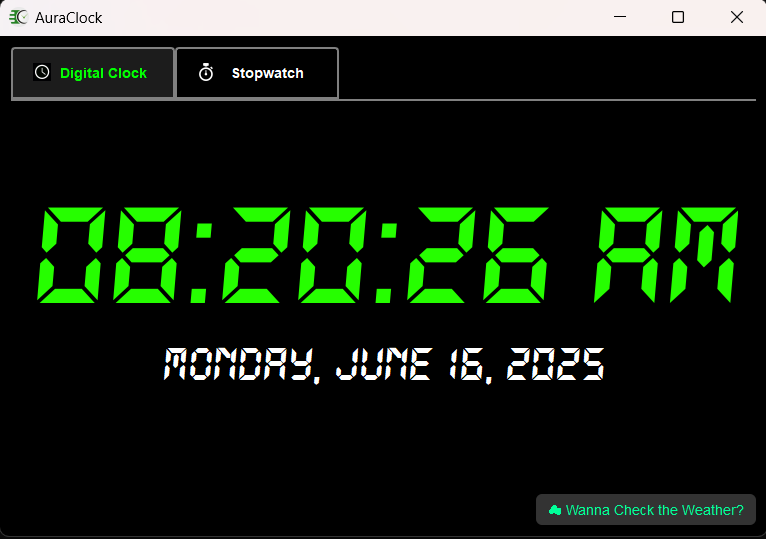
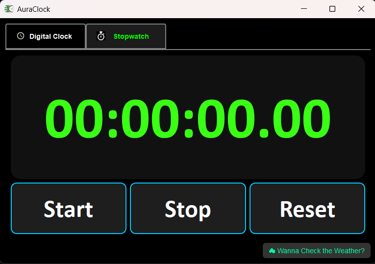
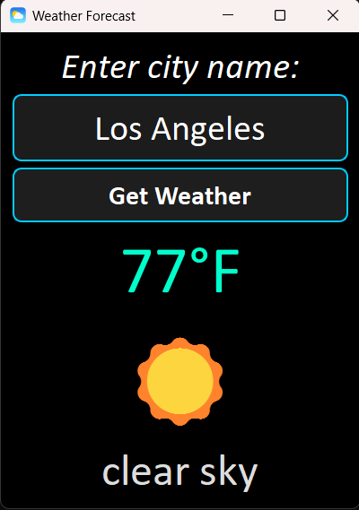

# 🕰️ AuraClock
AuraClock is a PyQt5-powered desktop application that brings together:
- Digital Clock ⏰
- Stopwatch ⏱️
- Weather Forecast 🌦️

## 📷 Screenshots

### Digital Clock


### Stopwatch


### Weather App


## 🚀 Installation

### 1️⃣ Clone this repository
```bash
git clone https://github.com/your-username/AuraClock.git
cd AuraClock
```

### 2️⃣ Install dependencies
```bash
pip install -r requirements.txt
```

#### OR manually install:
```bash
pip install PyQt5 requests
```

### 3️⃣ Run the app
```bash
python main.py
```

## 🔑 OpenWeather API Key
The weather module requires an OpenWeather API key.

Replace your API key directly in `weather_app.py`:
```python
api_key = "YOUR_API_KEY"
```

## 🖌️ UI Design Highlights
- Dark theme
- Neon colors
- Smooth, responsive layouts
- Weather emojis 🌦️

## 📄 License
This project is licensed under the [MIT License](LICENSE).

<p align="center"><b>Finish what you started 💻 </b></p>
